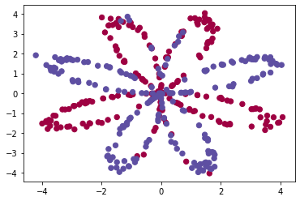
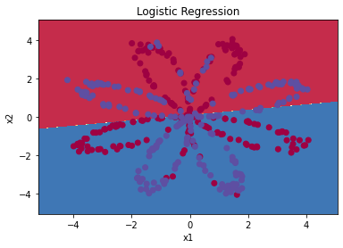
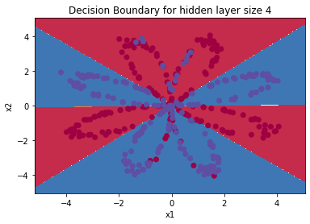
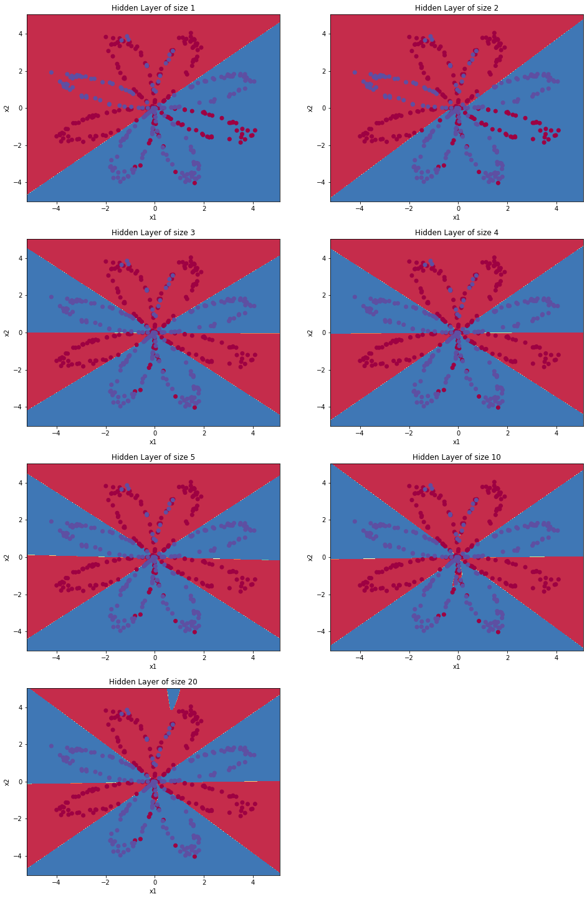
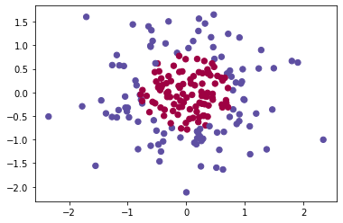

#  Classification with one hidden layer Planar data

Building neural network, which will have a hidden layer implementing using logistic regression. 

**From this project, I have learn how to:**
- Implement a 2-class classification neural network with a single hidden layer
- Use units with a non-linear activation function, such as tanh 
- Compute the cross entropy loss 
- Implement forward and backward propagation


## 1 - Packages ##

Let's first import all the packages that you will need during this project.
- [numpy](www.numpy.org) is the fundamental package for scientific computing with Python.
- [sklearn](http://scikit-learn.org/stable/) provides simple and efficient tools for data mining and data analysis. 
- [matplotlib](http://matplotlib.org) is a library for plotting graphs in Python.
- testCases provides some test examples to assess the correctness of your functions
- planar_utils provide various useful functions used in this project


```python
# Package imports
import numpy as np
import matplotlib.pyplot as plt
from testCases import *
import sklearn
import sklearn.datasets
import sklearn.linear_model
from planar_utils import plot_decision_boundary, sigmoid, load_planar_dataset, load_extra_datasets

%matplotlib inline

np.random.seed(1) # set a seed so that the results are consistent
```

## 2 - Dataset ##

First, let's get the dataset that will work on. The following code will load a "flower" 2-class dataset into variables `X` and `Y`.


```python
X, Y = load_planar_dataset() 
```

Visualize the dataset using matplotlib. The data looks like a "flower" with some red (label y=0) and some blue (y=1) points. My goal is to build a model to fit this data. 


```python
# Visualize the data:
plt.scatter(X[0, :], X[1, :], c=Y, s=40, cmap=plt.cm.Spectral);
```


    

    


I have:
    - a numpy-array (matrix) X that contains your features (x1, x2)
    - a numpy-array (vector) Y that contains your labels (red:0, blue:1).

Lets first get a better sense of what our data is like. 


```python

shape_X = X.shape
shape_Y = Y.shape

m = shape_X[1]  # training set size


print ('The shape of X is: ' + str(shape_X))
print ('The shape of Y is: ' + str(shape_Y))
print ('I have m = %d training examples!' % (m))
```

    The shape of X is: (2, 400)
    The shape of Y is: (1, 400)
    I have m = 400 training examples!


## 3 - Simple Logistic Regression

Before building a full neural network, lets first see how logistic regression performs on this problem. We can use sklearn's built-in functions to do that. Run the code below to train a logistic regression classifier on the dataset.


```python
# Train the logistic regression classifier
clf = sklearn.linear_model.LogisticRegressionCV();
clf.fit(X.T, Y.T);
```

    /Users/rajeshidumalla/opt/anaconda3/lib/python3.8/site-packages/sklearn/utils/validation.py:63: DataConversionWarning: A column-vector y was passed when a 1d array was expected. Please change the shape of y to (n_samples, ), for example using ravel().
      return f(*args, **kwargs)


Ploting the decision boundary of these models. Run the code below.


```python
# Plot the decision boundary for logistic regression
plot_decision_boundary(lambda x: clf.predict(x), X, Y)
plt.title("Logistic Regression")

# Print accuracy
LR_predictions = clf.predict(X.T)
print ('Accuracy of logistic regression: %d ' % float((np.dot(Y,LR_predictions) + np.dot(1-Y,1-LR_predictions))/float(Y.size)*100) +
       '% ' + "(percentage of correctly labelled datapoints)")
```

    Accuracy of logistic regression: 47 % (percentage of correctly labelled datapoints)


    

    


**Interpretation**: The dataset is not linearly separable, so logistic regression doesn't perform well. Hopefully a neural network will do better. Let's try this now! 

## 4 - Neural Network model

Logistic regression did not work well on the "flower dataset". I am going to train a Neural Network with a single hidden layer.

**Mathematically**:


### 4.1 - Defining the neural network structure ####

Defining three variables:
    - n_x: the size of the input layer
    - n_h: the size of the hidden layer (set this to 4) 
    - n_y: the size of the output layer

I am using the shapes of X and Y to find n_x and n_y. Also, hard code the hidden layer size to be 4.


```python
# GRADED FUNCTION: layer_sizes

def layer_sizes(X, Y):
    
   
    n_x = X.shape[0] # size of input layer
    n_h = 4
    n_y = Y.shape[0] # size of output layer
   
    return (n_x, n_h, n_y)
```


```python
X_assess, Y_assess = layer_sizes_test_case()
(n_x, n_h, n_y) = layer_sizes(X_assess, Y_assess)
print("The size of the input layer is: n_x = " + str(n_x))
print("The size of the hidden layer is: n_h = " + str(n_h))
print("The size of the output layer is: n_y = " + str(n_y))
```

    The size of the input layer is: n_x = 5
    The size of the hidden layer is: n_h = 4
    The size of the output layer is: n_y = 2


### 4.2 - Initialize the model's parameters ####

Implementing the function `initialize_parameters()`.


```python
# GRADED FUNCTION: initialize_parameters

def initialize_parameters(n_x, n_h, n_y):
    
    
    np.random.seed(2) # I am seting up a seed so that the output matches, although the initialization is random.
    
    
    W1 = np.random.randn(n_h,n_x) * 0.01
    b1 = np.zeros((n_h,1))
    W2 = np.random.randn(n_y,n_h) * 0.01
    b2 = np.zeros((n_y,1))
    
    
    assert (W1.shape == (n_h, n_x))
    assert (b1.shape == (n_h, 1))
    assert (W2.shape == (n_y, n_h))
    assert (b2.shape == (n_y, 1))
    
    parameters = {"W1": W1,
                  "b1": b1,
                  "W2": W2,
                  "b2": b2}
    
    return parameters
```


```python
n_x, n_h, n_y = initialize_parameters_test_case()

parameters = initialize_parameters(n_x, n_h, n_y)
print("W1 = " + str(parameters["W1"]))
print("b1 = " + str(parameters["b1"]))
print("W2 = " + str(parameters["W2"]))
print("b2 = " + str(parameters["b2"]))
```

    W1 = [[-0.00416758 -0.00056267]
     [-0.02136196  0.01640271]
     [-0.01793436 -0.00841747]
     [ 0.00502881 -0.01245288]]
    b1 = [[0.]
     [0.]
     [0.]
     [0.]]
    W2 = [[-0.01057952 -0.00909008  0.00551454  0.02292208]]
    b2 = [[0.]]


### 4.3 - The Loop ####

Implementinnng `forward_propagation()`.


```python
# GRADED FUNCTION: forward_propagation

def forward_propagation(X, parameters):
    
    # Retrieve each parameter from the dictionary "parameters"
    
    W1 = parameters["W1"]
    b1 = parameters["b1"]
    W2 = parameters["W2"]
    b2 = parameters["b2"]
    
    
    # Implement Forward Propagation to calculate A2 (probabilities)
    
    Z1 = np.dot(W1,X) + b1
    A1 = np.tanh(Z1)
    Z2 = np.dot(W2,A1) + b2
    A2 = sigmoid(Z2)
    
    
    assert(A2.shape == (1, X.shape[1]))
    
    cache = {"Z1": Z1,
             "A1": A1,
             "Z2": Z2,
             "A2": A2}
    
    return A2, cache
```


```python
X_assess, parameters = forward_propagation_test_case()

A2, cache = forward_propagation(X_assess, parameters)

# Note: we use the mean here just to make sure that your output matches ours. 
print(np.mean(cache['Z1']) ,np.mean(cache['A1']),np.mean(cache['Z2']),np.mean(cache['A2']))
```

    -0.0004997557777419913 -0.0004969633532317802 0.0004381874509591466 0.500109546852431


Now that I have computed $A^{[2]}$ (in the Python variable "`A2`"), which contains $a^{[2](i)}$ for every example, I can compute the cost function as follows:


Implementinng `compute_cost()` to compute the value of the cost $J$.


```python
# GRADED FUNCTION: compute_cost

def compute_cost(A2, Y, parameters):
    
    
    m = Y.shape[1] # number of example

    # Compute the cross-entropy cost
    
    logprobs = Y*np.log(A2) + (1-Y)* np.log(1-A2)
    cost = -1/m * np.sum(logprobs)
    
    
    cost = np.squeeze(cost)     # makes sure cost is the dimension we expect. 
                                # E.g., turns [[17]] into 17 
    assert(isinstance(cost, float))
    
    return cost
```


```python
A2, Y_assess, parameters = compute_cost_test_case()

print("cost = " + str(compute_cost(A2, Y_assess, parameters)))
```

    cost = 0.6929198937761265


By using the cache computed during forward propagation, I can now implement backward propagation.

Implementing the function `backward_propagation()`.


```python
# GRADED FUNCTION: backward_propagation

def backward_propagation(parameters, cache, X, Y):
    
    m = X.shape[1]
    
    # First, retrieve W1 and W2 from the dictionary "parameters".
    
    W1 = parameters["W1"]
    W2 = parameters["W2"]
    
        
    # Retrieve also A1 and A2 from dictionary "cache".
    
    A1 = cache["A1"]
    A2 = cache["A2"]
    
    
    # Backward propagation: calculate dW1, db1, dW2, db2. 
    
    dZ2= A2 - Y
    dW2 = 1 / m * np.dot(dZ2,A1.T)
    db2 = 1 / m * np.sum(dZ2,axis=1,keepdims=True)
    dZ1 = np.dot(W2.T,dZ2) * (1-np.power(A1,2))
    dW1 = 1 / m * np.dot(dZ1,X.T)
    db1 = 1 / m * np.sum(dZ1,axis=1,keepdims=True)
    
    
    grads = {"dW1": dW1,
             "db1": db1,
             "dW2": dW2,
             "db2": db2}
    
    return grads
```


```python
parameters, cache, X_assess, Y_assess = backward_propagation_test_case()

grads = backward_propagation(parameters, cache, X_assess, Y_assess)
print ("dW1 = "+ str(grads["dW1"]))
print ("db1 = "+ str(grads["db1"]))
print ("dW2 = "+ str(grads["dW2"]))
print ("db2 = "+ str(grads["db2"]))
```

    dW1 = [[ 0.01018708 -0.00708701]
     [ 0.00873447 -0.0060768 ]
     [-0.00530847  0.00369379]
     [-0.02206365  0.01535126]]
    db1 = [[-0.00069728]
     [-0.00060606]
     [ 0.000364  ]
     [ 0.00151207]]
    dW2 = [[ 0.00363613  0.03153604  0.01162914 -0.01318316]]
    db2 = [[0.06589489]]


Implementing the update rule using gradient descent. I am using (dW1, db1, dW2, db2) in order to update (W1, b1, W2, b2).


```python
# GRADED FUNCTION: update_parameters

def update_parameters(parameters, grads, learning_rate = 1.2):
    
    # Retrieve each parameter from the dictionary "parameters"
    
    W1 = parameters["W1"]
    b1 = parameters["b1"]
    W2 = parameters["W2"]
    b2 = parameters["b2"]
    
    
    # Retrieve each gradient from the dictionary "grads"
    
    dW1 = grads["dW1"]
    db1 = grads["db1"]
    dW2 = grads["dW2"]
    db2 = grads["db2"]
    
    
    # Update rule for each parameter
    
    W1 = W1 - learning_rate * dW1
    b1 = b1 - learning_rate * db1
    W2 = W2 - learning_rate * dW2
    b2 = b2 - learning_rate * db2
    
    
    parameters = {"W1": W1,
                  "b1": b1,
                  "W2": W2,
                  "b2": b2}
    
    return parameters
```


```python
parameters, grads = update_parameters_test_case()
parameters = update_parameters(parameters, grads)

print("W1 = " + str(parameters["W1"]))
print("b1 = " + str(parameters["b1"]))
print("W2 = " + str(parameters["W2"]))
print("b2 = " + str(parameters["b2"]))
```

    W1 = [[-0.00643025  0.01936718]
     [-0.02410458  0.03978052]
     [-0.01653973 -0.02096177]
     [ 0.01046864 -0.05990141]]
    b1 = [[-1.02420756e-06]
     [ 1.27373948e-05]
     [ 8.32996807e-07]
     [-3.20136836e-06]]
    W2 = [[-0.01041081 -0.04463285  0.01758031  0.04747113]]
    b2 = [[0.00010457]]


### 4.4 - Integrate parts 4.1, 4.2 and 4.3 in nn_model() ####


```python
# GRADED FUNCTION: nn_model

def nn_model(X, Y, n_h, num_iterations = 10000, print_cost=False):

    
    np.random.seed(3)
    n_x = layer_sizes(X, Y)[0]
    n_y = layer_sizes(X, Y)[2]
    
    # Initialize parameters, then retrieve W1, b1, W2, b2. Inputs: "n_x, n_h, n_y". Outputs = "W1, b1, W2, b2, parameters".
    
    parameters = initialize_parameters(n_x, n_h, n_y)
    W1 = parameters["W1"]
    b1 = parameters["b1"]
    W2 = parameters["W2"]
    b2 = parameters["b2"]
    
    
    # Loop (gradient descent)

    for i in range(0, num_iterations):
         
        
        # Forward propagation. Inputs: "X, parameters". Outputs: "A2, cache".
        A2, cache = forward_propagation(X, parameters)
        
        # Cost function. Inputs: "A2, Y, parameters". Outputs: "cost".
        cost = compute_cost(A2, Y, parameters)
 
        # Backpropagation. Inputs: "parameters, cache, X, Y". Outputs: "grads".
        grads = backward_propagation(parameters, cache, X, Y)
 
        # Gradient descent parameter update. Inputs: "parameters, grads". Outputs: "parameters".
        parameters = update_parameters(parameters, grads)
        
        
        
        # Print the cost every 1000 iterations
        if print_cost and i % 1000 == 0:
            print ("Cost after iteration %i: %f" %(i, cost))

    return parameters
```


```python
X_assess, Y_assess = nn_model_test_case()

parameters = nn_model(X_assess, Y_assess, 4, num_iterations=10000, print_cost=False)
print("W1 = " + str(parameters["W1"]))
print("b1 = " + str(parameters["b1"]))
print("W2 = " + str(parameters["W2"]))
print("b2 = " + str(parameters["b2"]))
```

    <ipython-input-13-991ce5e9d2fe>:20: RuntimeWarning: divide by zero encountered in log
      logprobs = Y*np.log(A2) + (1-Y)* np.log(1-A2)
    /Users/rajeshidumalla/planar_utils.py:34: RuntimeWarning: overflow encountered in exp
      s = 1/(1+np.exp(-x))


    W1 = [[-4.18491249  5.33220652]
     [-7.52991891  1.24304481]
     [-4.19257906  5.32654053]
     [ 7.52989842 -1.24305585]]
    b1 = [[ 2.32930709]
     [ 3.79453736]
     [ 2.33008777]
     [-3.79456804]]
    W2 = [[-6033.83651818 -6008.12961806 -6033.10073783  6008.06596049]]
    b2 = [[-52.66626424]]


### 4.5 Predictions

Using the model to predict by building predict() by using forward propagation to predict results.


```python
# GRADED FUNCTION: predict

def predict(parameters, X):
    
    
    # Computes probabilities using forward propagation, and classifies to 0/1 using 0.5 as the threshold.

    A2, cache = forward_propagation(X, parameters)
    predictions = np.round(A2)

    
    return predictions
```


```python
parameters, X_assess = predict_test_case()

predictions = predict(parameters, X_assess)
print("predictions mean = " + str(np.mean(predictions)))
```

    predictions mean = 0.6666666666666666


It is time to run the model and see how it performs on a planar dataset. Running the following code to test the model with a single hidden layer of $n_h$ hidden units.


```python
# Build a model with a n_h-dimensional hidden layer
parameters = nn_model(X, Y, n_h = 4, num_iterations = 10000, print_cost=True)

# Plot the decision boundary
plot_decision_boundary(lambda x: predict(parameters, x.T), X, Y)
plt.title("Decision Boundary for hidden layer size " + str(4))
```

    Cost after iteration 0: 0.693048
    Cost after iteration 1000: 0.288083
    Cost after iteration 2000: 0.254385
    Cost after iteration 3000: 0.233864
    Cost after iteration 4000: 0.226792
    Cost after iteration 5000: 0.222644
    Cost after iteration 6000: 0.219731
    Cost after iteration 7000: 0.217504
    Cost after iteration 8000: 0.219456
    Cost after iteration 9000: 0.218558


    Text(0.5, 1.0, 'Decision Boundary for hidden layer size 4')


    

    


```python
# Print accuracy
predictions = predict(parameters, X)
print ('Accuracy: %d' % float((np.dot(Y,predictions.T) + np.dot(1-Y,1-predictions.T))/float(Y.size)*100) + '%')
```

    Accuracy: 90%


Accuracy is really high compared to Logistic Regression. The model has learnt the leaf patterns of the flower! Neural networks are able to learn even highly non-linear decision boundaries, unlike logistic regression. 

Now, let's try out several hidden layer sizes.

### 4.6 - Tuning hidden layer size (optional/ungraded exercise) ###

By running the following code, we will observe different behaviors of the model for various hidden layer sizes.


```python
# This may take about 2 minutes to run

plt.figure(figsize=(16, 32))
hidden_layer_sizes = [1, 2, 3, 4, 5, 10, 20]
for i, n_h in enumerate(hidden_layer_sizes):
    plt.subplot(5, 2, i+1)
    plt.title('Hidden Layer of size %d' % n_h)
    parameters = nn_model(X, Y, n_h, num_iterations = 5000)
    plot_decision_boundary(lambda x: predict(parameters, x.T), X, Y)
    predictions = predict(parameters, X)
    accuracy = float((np.dot(Y,predictions.T) + np.dot(1-Y,1-predictions.T))/float(Y.size)*100)
    print ("Accuracy for {} hidden units: {} %".format(n_h, accuracy))
```

    Accuracy for 1 hidden units: 67.5 %
    Accuracy for 2 hidden units: 67.25 %
    Accuracy for 3 hidden units: 90.75 %
    Accuracy for 4 hidden units: 90.5 %
    Accuracy for 5 hidden units: 91.25 %
    Accuracy for 10 hidden units: 90.25 %
    Accuracy for 20 hidden units: 90.5 %


    

    


**Interpretation**:
- The larger models (with more hidden units) are able to fit the training set better, until eventually the largest models overfit the data. 
- The best hidden layer size seems to be around n_h = 5. Indeed, a value around here seems to  fits the data well without also incurring noticable overfitting.
- We also do some regularization, which lets you use very large models (such as n_h = 50) without much overfitting. 

## 5) Performance on other datasets

If you want, you can rerun the whole notebook (minus the dataset part) for each of the following datasets.


```python
# Datasets
noisy_circles, noisy_moons, blobs, gaussian_quantiles, no_structure = load_extra_datasets()

datasets = {"noisy_circles": noisy_circles,
            "noisy_moons": noisy_moons,
            "blobs": blobs,
            "gaussian_quantiles": gaussian_quantiles}


dataset = "gaussian_quantiles"


X, Y = datasets[dataset]
X, Y = X.T, Y.reshape(1, Y.shape[0])

# make blobs binary
if dataset == "blobs":
    Y = Y%2

# Visualize the data
plt.scatter(X[0, :], X[1, :], c=Y, s=40, cmap=plt.cm.Spectral);
```


    

    

